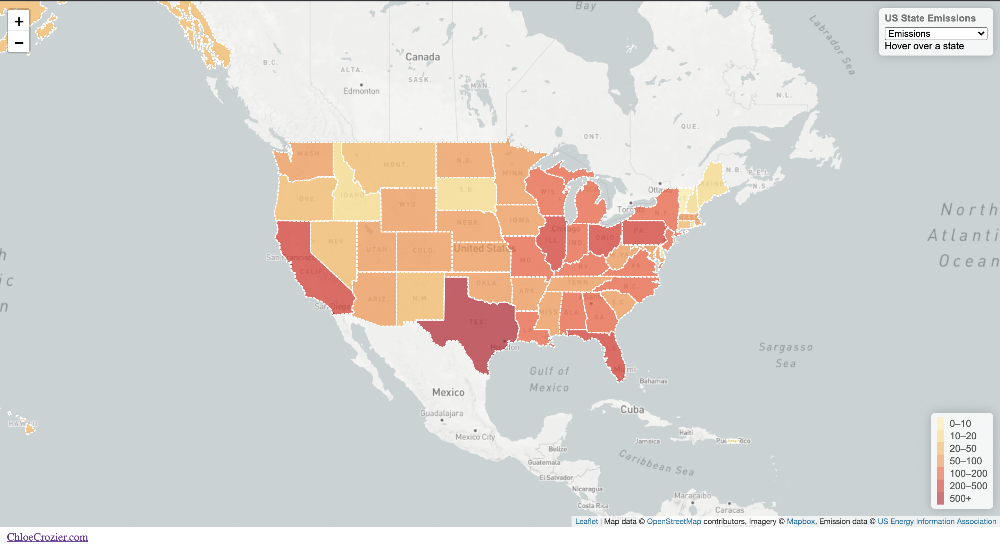

# State Data Project

This is a project to display state carbon emission data onto a map.

Demo Link: https://chloecrozier.com/state-data

Preview: 

Project Prerequisites: Node, NPM 

Instructions:
- To get started, change directories `cd state-data`.
- Run `npm install`.
- Update `data.csv`.
- Run `node update.js`.
- View the `index.html` file locally.